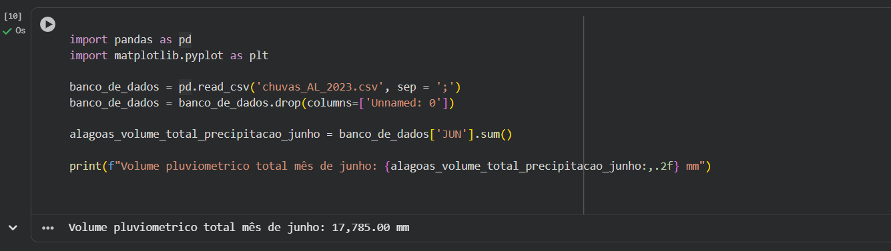
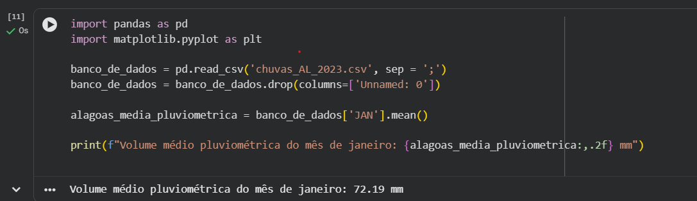
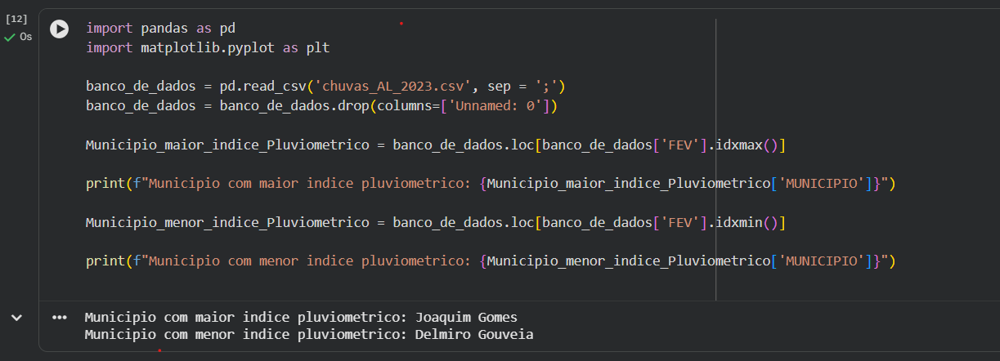
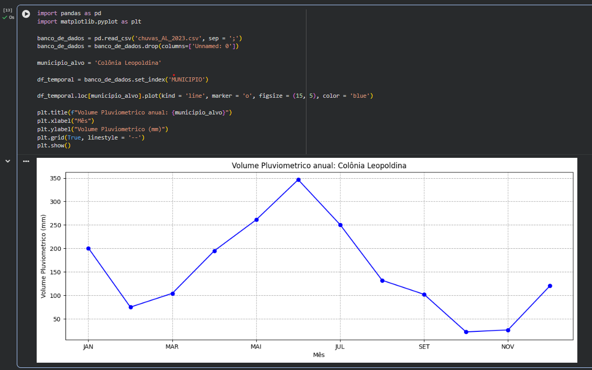
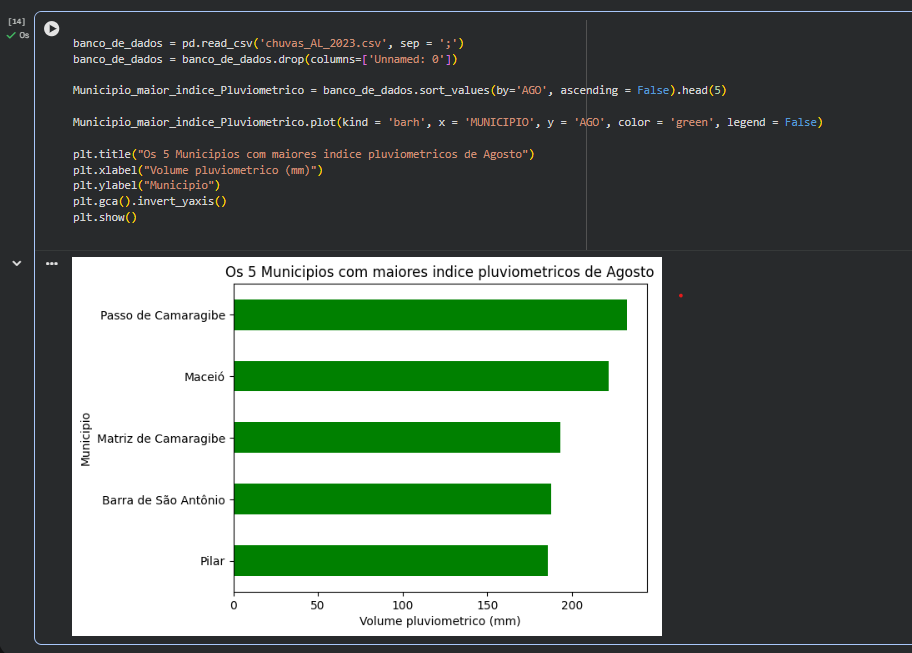
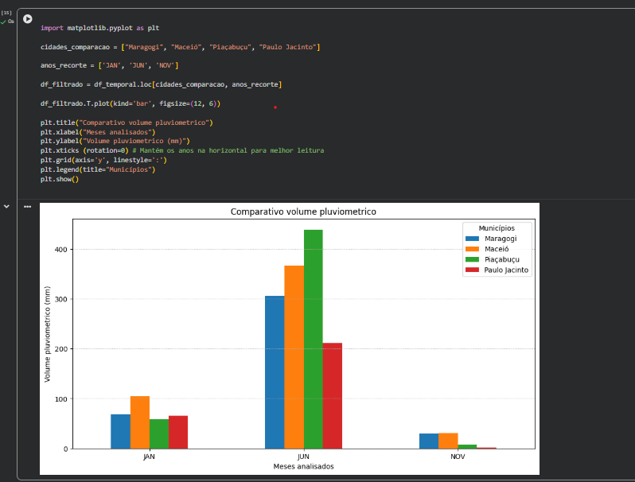
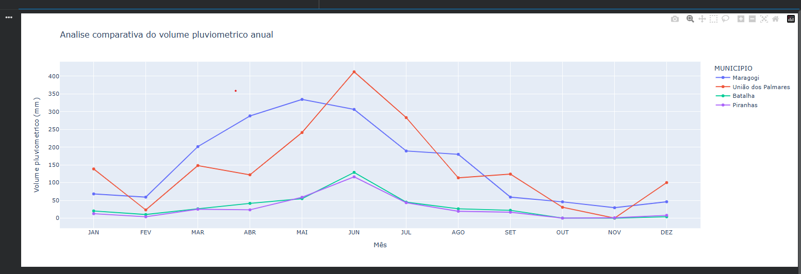
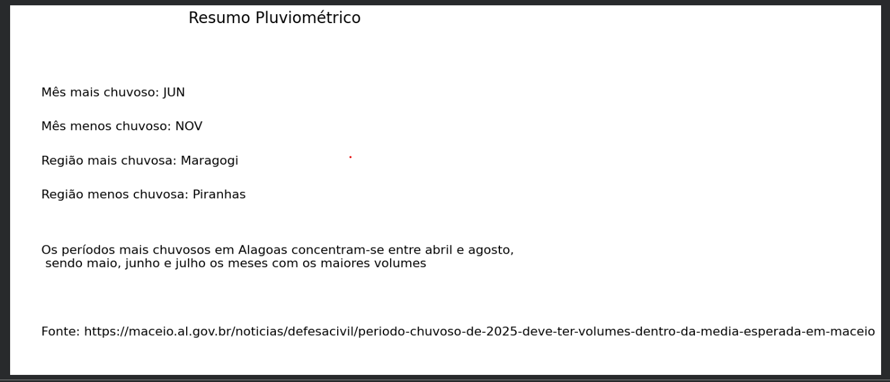

# Análise de Dados Pluviométricos do Estado de Alagoas

---

## Volume Pluviométrico Total do Estado de Alagoas

---

## Volume Pluviométrico Médio do Estado de Alagoas no Mês de Janeiro

---

## Município com Maior e Menor Índice Pluviométrico

---

## Volume Pluviométrico Anual do Município de Colônia Leopoldina

---

## Cinco Municípios com os Maiores Índices Pluviométricos

---

## Comparação dos Meses de Janeiro, Junho e Novembro

---

## Gráfico Interativo

---

## Resumo Estatístico dos Dados Pluviométricos

---
